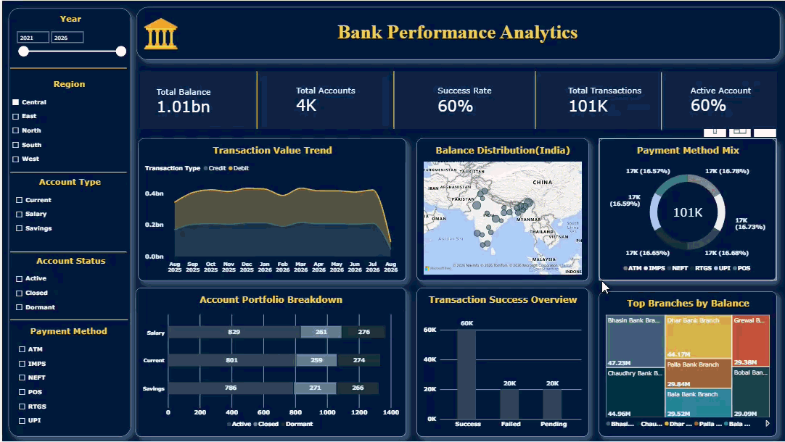

# 🏦 Bank Performance Analytics — Power BI Dashboard

An interactive **Power BI dashboard for Bank Performance Analytics**, designed to analyze account portfolios, balances, transaction activity, payment methods, regional performance, branch balances, and transaction outcomes.

This project demonstrates practical **Business Analyst / Data Analyst** skills: data preparation, data modeling, KPI development, interactive filtering, geographic analysis, trend analysis, and business insight generation using Power BI.

## 📊 Dashboard Preview



---

## 🎯 Project Objective

The goal of this project is to turn banking account, branch, and transaction data into an interactive management dashboard that answers operational and performance questions such as:

- How large is the account portfolio and balance base?
- What proportion of accounts are Active, Closed, or Dormant?
- How are transactions distributed across payment methods?
- What is the overall transaction success rate?
- Which regions and branches hold the largest balances?
- How does transaction value change over time?
- Which account types contribute most to the portfolio?
- Where do transaction failures and pending transactions occur?

---

## 🛠️ Tools & Technologies

- **Microsoft Power BI**
- Power Query / data preparation
- Data modeling and table relationships
- DAX measures / calculated metrics
- Interactive slicers and filters
- KPI cards
- Time-series analysis
- Geographic / map visualization
- Donut, bar, area and treemap visuals
- Business-focused dashboard design

---

## 📁 Dataset Overview

The repository contains three source datasets:

| Dataset | Records | Purpose |
|---|---:|---|
| `accounts.csv` | 20,050 | Account-level balance, type, status, opening date and branch mapping |
| `branches.csv` | 200 | Branch name, city, state and region reference data |
| `transactions.csv` | 501,000 | Transaction date, type, amount, payment method, merchant and status |

### Data coverage

- **Accounts:** 2021-08-07 to 2026-08-07
- **Transactions:** 2025-08-07 to 2026-08-07
- **Regions:** Central, East, North, South and West
- **Account types:** Current, Salary and Savings
- **Payment methods:** ATM, IMPS, NEFT, POS, RTGS and UPI
- **Transaction statuses:** Success, Failed, Pending and a small number of `UNKNOWN` records

---

## 📌 Dashboard KPIs

The dashboard provides KPI cards for:

- Total Balance
- Total Accounts
- Transaction Success Rate
- Total Transactions
- Active Accounts

The dashboard also provides interactive filtering by **Year, Region, Account Type, Account Status, and Payment Method**.

### Dashboard snapshot

The supplied dashboard screenshot displays approximately:

| KPI | Dashboard Snapshot |
|---|---:|
| Total Balance | 1.01B |
| Total Accounts | 4K |
| Success Rate | 60% |
| Total Transactions | 101K |
| Active Account | 60% |

> These values are the values visible in the supplied dashboard screenshot. The repository also contains the full source datasets, which contain more records than the specific dashboard view shown in the screenshot.

---

## 📈 Dashboard Components

### 1. Transaction Value Trend

Tracks transaction value over time and compares **Credit vs Debit** activity.

### 2. Balance Distribution — India

Uses geographic visualization to show balance distribution across Indian branch locations.

### 3. Payment Method Mix

Compares transaction activity across ATM, IMPS, NEFT, POS, RTGS and UPI.

### 4. Account Portfolio Breakdown

Breaks down accounts by **Current, Salary and Savings** and compares account status composition.

### 5. Transaction Success Overview

Shows the distribution of **Successful, Failed and Pending** transactions.

### 6. Top Branches by Balance

Identifies branches with the highest total account balances using a treemap visualization.

### 7. Interactive Filters

The dashboard can be explored using filters for:

- Year
- Region
- Account Type
- Account Status
- Payment Method

---

## 🔎 Data-Driven Findings

The following figures were calculated from the source datasets included in this repository. They describe the **full source data**, not only the filtered dashboard snapshot.

### Account Portfolio

- 20,050 account records are present.
- Total recorded account balance is approximately **₹5.03B**.
- **11,936 accounts (59.5%)** are Active.
- **4,058** are Dormant and **4,056** are Closed.
- Salary, Savings and Current accounts contribute broadly similar portfolio volumes.

### Transactions

- 501,000 transaction records are present.
- Total recorded transaction value is approximately **₹25.05B**.
- **300,446 transactions (60.0%)** are marked Successful.
- **100,257** are Failed and **100,197** are Pending.
- The dataset contains **100 `UNKNOWN` transaction-status records**.

### Payment Methods

Transaction value is distributed relatively evenly across the six payment methods. **IMPS** has the largest recorded transaction value in the source data at approximately **₹4.21B**, followed by ATM and UPI.

### Regional Account Balance

After matching account records to branch regions and standardizing capitalization for analysis:

| Region | Accounts | Balance |
|---|---:|---:|
| West | 4,311 | ₹1.09B |
| North | 4,051 | ₹1.01B |
| Central | 4,023 | ₹1.01B |
| East | 3,772 | ₹0.95B |
| South | 3,743 | ₹0.94B |

### Top Branches by Balance

The highest-balance branches in the source data include Oak Bank Branch, Sule Bank Branch, Venkatesh Bank Branch, Bobal Bank Branch and Chandra Bank Branch.

---

## ⚠️ Data Quality Checks

The source data contains a few quality issues that are useful from a Business Analyst perspective:

- Region values use inconsistent capitalization in some records, such as `North` and `north`.
- 100 account records do not match to a branch record.
- 2,508 transactions do not match to an account record.
- Transaction status contains 100 `UNKNOWN` values.
- Transaction type contains both uppercase and lowercase variants (`Credit` / `credit`, `Debit` / `debit`).

These issues are important because inconsistent categories or missing relationships can affect Power BI measures and visualizations.

---

## 💡 Business Insights

### Portfolio management

Active accounts represent about 60% of the account base, while the remaining accounts are Dormant or Closed. This creates an opportunity for account-status monitoring and customer re-engagement analysis.

### Transaction reliability

The overall success rate is approximately 60%, with the remainder consisting primarily of failed and pending transactions. Transaction-status monitoring can therefore be used as an operational KPI.

### Regional performance

West, North and Central show the largest recorded account-balance pools in the full source data. Regional comparisons can support branch-level resource planning and performance monitoring.

### Payment behavior

Transaction value is relatively balanced across the six payment methods, so the dashboard can be used to monitor shifts in customer payment-channel preferences rather than focusing on a single dominant method.

### Branch concentration

The branch-level balance view helps identify branches with comparatively high balance holdings, supporting deeper branch performance analysis.

---

## 📌 Business Recommendations

Based on the descriptive analysis, a business team could:

- Monitor failed and pending transactions as operational KPIs.
- Investigate regions and branches with unusually high or low transaction activity.
- Standardize categorical values before future reporting cycles.
- Reconcile transactions that do not match an account record.
- Review dormant-account levels for customer engagement initiatives.
- Track payment-method trends over time to understand channel adoption.
- Use branch-level balance concentration to support management review and resource planning.

These are **data-driven areas for investigation**, not predictive conclusions.

---

## 🧮 Suggested KPI Definitions

| KPI | Definition |
|---|---|
| Total Balance | Sum of account balances in the selected filter context |
| Total Accounts | Count of account records in the selected filter context |
| Success Rate | Successful transactions ÷ total transactions |
| Total Transactions | Count of transaction records in the selected filter context |
| Active Account % | Active accounts ÷ total accounts |
| Transaction Value | Sum of transaction amount |

---

## 📂 Repository Structure

```text
bank-performance-analytics-powerbi/
│
├── README.md
├── .gitignore
│
├── assets/
│   └── dashboard_preview.png
│
├── PowerBI/
│   └── bank_performance_analytics.pbix
│
├── data/
│   ├── accounts.csv
│   ├── branches.csv
│   └── transactions.csv
│
└── documentation/
    ├── business_insights.md
    └── data_dictionary.md
```

---

## 🚀 How to Use the Project

1. Download `PowerBI/bank_performance_analytics.pbix`.
2. Open it in **Microsoft Power BI Desktop**.
3. If Power BI asks for source paths, update the file locations to the CSV files in the `data` folder.
4. Refresh the model if required.
5. Use the dashboard slicers to explore year, region, account type, account status and payment-method performance.

> The Power BI file is included as the main portfolio artifact. The CSV files are provided so the analysis can be reproduced or inspected.

---

## 🧠 Skills Demonstrated

- Power BI Dashboard Development
- Business Analysis
- Data Cleaning & Validation
- Data Modeling
- DAX / KPI Development
- Data Visualization
- Banking & Financial Analytics
- Transaction Analysis
- Regional Analysis
- Branch Performance Analysis
- Account Portfolio Analysis
- Data Quality Assessment
- Business Insight Generation
- Interactive Reporting

---

## 👤 Portfolio Context

This project is part of a practical **Business Analyst / Data Analyst portfolio**, demonstrating how raw operational banking data can be transformed into an interactive management dashboard for performance monitoring and business analysis.

**Focus:** Power BI • Business Analysis • Banking Analytics • KPI Reporting • Data Visualization • Data Quality
